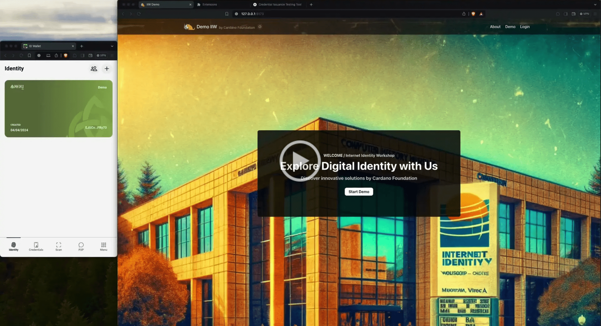

<h1 align="center" style="border-bottom: none">Cardano Foundation | Project Tunnel 🚇</h1>

> **Disclaimer:**
>
> - **Support for Project Tunnel in the ID Wallet is currently not available**. This project was initially developed as a Proof of Concept (PoC), and the integration will be resumed when we have the capacity to do so.
> - The **ESSR payloads are not currently using native CESR** due to its unavailability at the time of development. Future updates may incorporate this feature as it becomes supported.
> - For enhanced confidentiality and security, it is recommended to **use a single REST endpoint with routed messages**, rather than exposing multiple endpoints.


### Overview

**Project Tunnel** is a cutting-edge browser extension that introduces passwordless authentication and replaces traditional HTTPS with the **[KERI (Key Event Receipt Infrastructure) Protocol](https://trustoverip.github.io/tswg-keri-specification/)**. This extension acts as a secure bridge between websites and the Cardano Foundation's [cf-identity-wallet](https://github.com/cardano-foundation/cf-identity-wallet), leveraging decentralized identity technology to ensure safe and private web interactions.

### Key Features

1. **Interactive Passwordless Authentication:**  
   Project Tunnel revolutionizes user authentication on websites by eliminating the need for passwords. Instead, users directly link the browser extension with their mobile identity wallet using KERI protocols to authorize secure web interactions.

2. **Secure KERI-Enabled Communication Replacement for HTTPS:**  
   The extension uses Hybrid Public Key Encryption (HPKE) with crypto box seal from libsodium, focusing on the public key of the server which enables the server to decrypt messages. This hybrid approach enhances performance while maintaining high security standards. By integrating the browser extension with KERI protocols, all web communications are encrypted using ephemeral keys, ensuring that each session is securely encrypted and authenticated.

### Why KERI Over HTTPS?

HTTPS, while widely adopted, is prone to a variety of security vulnerabilities primarily due to its reliance on shared secrets and bearer tokens. In contrast, **Project Tunnel** leverages the KERI protocol to significantly enhance web security. Each request through KERI can be asymmetrically signed and encrypted, providing robust security against many common attacks. Additionally, KERI utilizes verifiable credentials which improve upon traditional password-based systems by ensuring that each transaction is both secure and traceable to a verified identity.

Moreover, KERI effectively replaces traditional Root Certificate Authorities (CAs) by enabling servers to present their own verifiable credentials to prove their legitimacy. This shift not only enhances security but also decentralizes trust, allowing organizations to demonstrate their identity directly to users without the need for intermediary CAs.

### End-to-End Demo

Gain a deeper understanding of **Project Tunnel** by watching our demo:

[](https://drive.google.com/file/d/1vaQfqRTR_aS_cfWc3VZ-4DDICs7FtuJl/view)

This video offers a detailed walkthrough of the extension's key features and functionalities, showcasing the seamless integration of KERI-based authentication and communication.

## Getting Started

### Project Structure

**Project Tunnel** is organized into several key components to facilitate development and deployment. Below is a breakdown of the major elements:

#### Demo Environment
The `demo` directory encapsulates the demonstration environment, which includes both a server-side application and a user interface to showcase the extension's capabilities.

- **Server (`demo/server`):** This contains all the server-side logic required to support the extension, including API endpoints, middleware for encryption and verification, and the configuration files needed for deployment. The server is containerized using Docker, facilitating easy setup and scalability.

- **User Interface (`demo/ui`):** The UI provides a frontend display to interact with the extension, demonstrating its features in a real-world scenario. This part of the demo includes all frontend assets, configuration for nginx, and is also prepared for Docker deployment.

#### Extension Implementation
The core implementation of the extension is housed in the `src` directory, organized into several subdirectories for modular development:

- **Core (`src/core`):** Includes the main background scripts that handle the non-UI logic of the extension, such as API communications and background processing.

- **UI (`src/ui`):** Contains all the user interface components for the extension, including HTML, CSS, and TypeScript files that define the look and feel as well as the interactivity of the extension.

#### Docker Integration
The project is Docker-ready, with Dockerfiles located in both the `demo/server` and `demo/ui` directories to containerize the server and UI respectively. A `docker-compose.yml` file is also provided to orchestrate the containers, ensuring that the entire demo environment can be deployed seamlessly.

This structured approach not only supports efficient development workflows but also ensures that contributors and new developers can easily understand and become involved in the project.


### Prerequisites

Make sure you have the following installed:
- [Node.js](https://nodejs.org/) (version 18.16.0 or higher)
- [npm](https://www.npmjs.com/) (bundled with Node.js)

### Installation Steps

1. **Clone the repository:**

    ```bash
    https://github.com/cardano-foundation/cf-poc-tunnel.git    
   ```

2. **Navigate to the project directory:**

    ```bash
    cd project-tunnel
    ```

3. **Install dependencies:**

    ```bash
    npm install
    ```

### Available Scripts

Enhance your development experience with these predefined npm scripts:

- **Start the development server:**

    ```bash
    npm start
    ```

  Initiates the project in development mode, with Webpack monitoring for any file changes.

- **Build the project for production:**

    ```bash
    npm run build
    ```

  Compiles the project into the `dist` folder, optimized for production deployment.

- **Lint your code:**

    ```bash
    npm run lint
    ```

  Checks your code for issues using [ESLint](https://eslint.org/).

- **Format your code:**

    ```bash
    npm run prettier
    ```

  Formats your code following [Prettier](https://prettier.io/) standards.

### Using the Extension

Deploy the extension in Google Chrome or Brave by following these steps:

1. Open Chrome and go to the Extensions page (`chrome://extensions`).
2. Toggle **Developer mode** on in the top-right corner.
3. Select **Load unpacked** and choose the `dist` folder from this project.

# Contributing

All contributions are welcome! Please feel free to open a new thread on the issue tracker or submit a new pull request.

Please read [Contributing](CONTRIBUTING.md) in advance.  Thank you for contributing!

## Additional Documents
- [Code of Conduct](CODE_OF_CONDUCT.md)
- [Security](SECURITY.md)